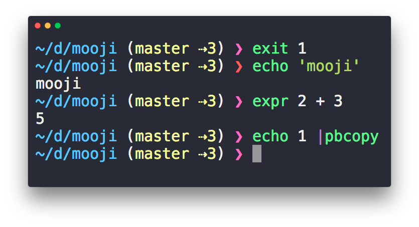

# Mooji

> Minimal, beautiful and fast fish prompt



## Requirements

- [fish](https://github.com/fish-shell/fish-shell) - Tested with v3

## Installation

   ```sh
   fisher add rodrigobdz/mooji
   ```

## Related Projects

- [brandonweiss/pure.fish](https://github.com/brandonweiss/pure.fish) -
A [Pure](https://github.com/sindresorhus/pure)-inspired prompt for fish shell
- [sindresorhus/pure](https://github.com/sindresorhus/pure) - Pretty, minimal and fast ZSH prompt

## Credits

- This readme is based on [rodrigobdz/minimal-readme](https://github.com/rodrigobdz/minimal-readme).
- Screenshot made with [sindresorhus/iterm2-snazzy](https://github.com/sindresorhus/iterm2-snazzy), [Hyper](https://hyper.is) and [mooji](https://github.com/rodrigobdz/mooji) of course.

## License

[MIT](LICENSE) © [rodrigobdz](https://rodrigobdz.github.io/).
